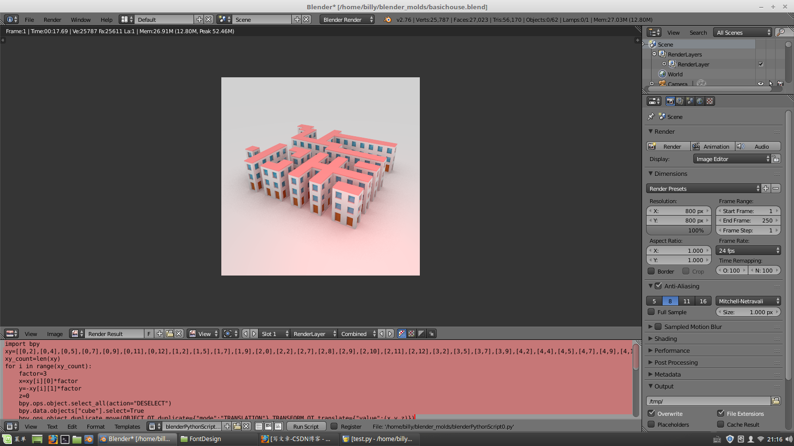

### 从基本的建筑单元按照字形平面布局生成综合建筑体

先在blender中用手工制作好一个建筑单元（名称定为“Cube”），然后在blender中打开一个“Text Editor”编辑窗口，在里面写入python脚本：

    import bpy
    xy=[[0,2],[0,4],[0,5],[0,7],[0,9],[0,11],[0,12],[1,2],[1,5],[1,7],[1,9],[2,0],[2,2],[2,7],[2,8],[2,9],[2,10],[2,11],[2,12],[3,2],[3,5],[3,7],[3,9],[4,2],[4,4],[4,5],[4,7],[4,9],[4,11],[4,12],[6,7],[6,8],[6,9],[6,10],[6,11],[6,12],[7,2],[7,3],[7,4],[7,5],[7,6],[7,7],[8,2],[8,5],[9,2],[9,5],[10,1],[10,2],[10,5],[10,6],[10,7],[10,8],[10,9],[10,10],[10,11],[10,12],[11,0],[11,1],[11,5]]
    xy_count=len(xy)
    for i in range(xy_count):
        factor=3
        x=xy[i][0]*factor
        y=-xy[i][1]*factor
        z=0
        bpy.ops.object.select_all(action="DESELECT")
        bpy.data.objects["cube"].select=True
        bpy.ops.object.duplicate_move(OBJECT_OT_duplicate={"mode":"TRANSLATION"},TRANSFORM_OT_translate={"value":(x,y,z)})
        

        
